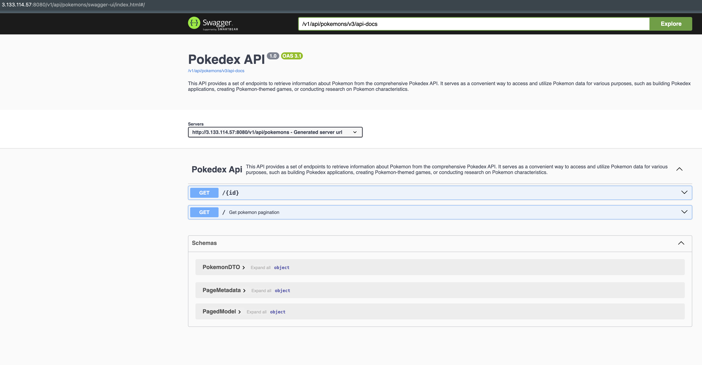

# Pokemon Information API

This API provides a set of endpoints to retrieve information about Pokemon from the comprehensive [Pokedex API](https://pokeapi.co/). It serves as a convenient way to access and utilize Pokemon data for various purposes, such as building Pokedex applications, creating Pokemon-themed games, or conducting research on Pokemon characteristics.

## API Endpoints

### 1. Get Pokemon by ID

*   **Endpoint:** `GET /pokemons/{pokemonId}`
*   **Description:** Retrieves detailed information about a Pokemon by ID.
  *   **Response:**

```json
  {
      "id": 2,
      "name": "ivysaur",
      "type": "grass",
      "weight": 130,
      "abilities": [
          "overgrow",
          "chlorophyll"
      ],
      "image": "https://raw.githubusercontent.com/PokeAPI/sprites/master/sprites/pokemon/other/official-artwork/2.png",
      "description": "Proud of its power",
      "evolutions": [
          "bulbasaur",
          "ivysaur",
          "venusaur"
      ]
  }
```

### 2. Get all Pokemons

*   **Endpoint:** `GET /pokemons?size={pageSize}&page={pageNumber}`
*   **Description:** This endpoint allows you to retrieve a paginated list of Pokemon, which is useful for efficiently and controllably displaying large numbers of Pokemon. Instead of loading all Pokemon at once, the list is divided into smaller pages, which improves performance and user experience.
*   **Response:**

    ```json
    {
      "content": [
        {
          "id": 1,
          "name": "bulbasaur",
          "type": "grass",
          "weight": 69,
          "abilities": [
            "overgrow",
            "chlorophyll"
          ],
          "image": "https://raw.githubusercontent.com/PokeAPI/sprites/master/sprites/pokemon/other/official-artwork/1.png"
        },
        {
          "id": 2,
          "name": "ivysaur",
          "type": "grass",
          "weight": 130,
          "abilities": [
            "overgrow",
            "chlorophyll"
          ],
          "image": "https://raw.githubusercontent.com/PokeAPI/sprites/master/sprites/pokemon/other/official-artwork/2.png"
          }
      ],
      "page": {
        "size": 2,
        "number": 0,
        "totalElements": 1304,
        "totalPages": 652
      }
    }
    ```

## Data Source

The data for this API is sourced from the [Pokedex API](https://pokeapi.co/), a comprehensive and well-maintained RESTful API that provides a wealth of information about Pokemon.

## Error Handling

The API returns appropriate HTTP status codes to indicate the success or failure of a request. In case of an error, the response body may contain additional details about the error.

## Rate Limiting

The API may have rate limits in place to prevent abuse. If you exceed the rate limit, you may receive an error response.

## API Documentation

For more detailed information about the API endpoints, request/response formats, and error handling, please refer to the API documentation. [Swagger UI](http://3.133.114.57:8080/v1/api/pokemons/swagger-ui/index.html)

## AWS Process

Create redis image from dockerfile


Push redis image to remote docker repository


Package api


Build api image


Push api image 


Create instance on AWS EC2


Connect to EC2 


Install docker in the EC2 instance

[Install docker with Docker documentation](https://docs.docker.com/engine/install/ubuntu/)

Pull redis image and run container


Pull api image and run container


Verify that containers are working


You can now access the Swagger UI ([link](http://3.133.114.57:8080/v1/api/pokemons/swagger-ui/index.html))

